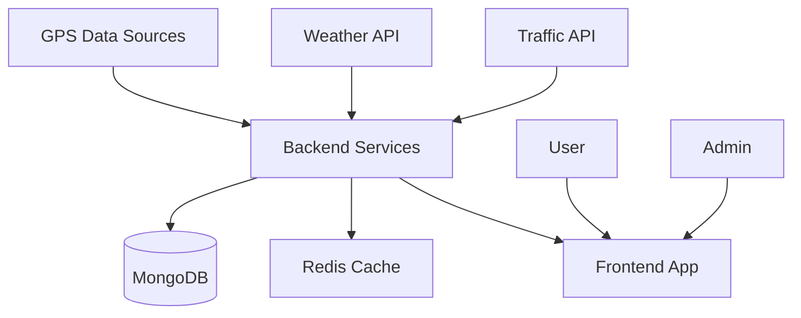

# BusRadar - Real-time Bus Tracking Platform

A real-time bus tracking system powered by Java Spring Boot and ReactJS, offering precise arrival predictions and delay forecasts through GPS integration and advanced analytics.

[](LICENSE)
[](docs/)
[](https://codecov.io/gh/yourusername/bus-radar)

## Overview

- **Backend**: Java Spring Boot with MongoDB for scalable data management
- **Frontend**: ReactJS with interactive mapping capabilities
- **Analytics**: SURE (Seemingly Unrelated Regression Equation) model for predictions
- **Purpose**: Academic project for COMP 8157: Advanced Database Topics (University of Windsor)
- **Supervisor**: Dr. Abdulrauf Gidado

## Features

- 🚌 Real-time bus location tracking
- ⏱️ Accurate arrival time predictions
- 🗺️ Interactive route visualization
- 📊 Transit authority analytics dashboard
- 🌦️ Weather and traffic-aware predictions

## Tech Stack

### Backend
- Java Spring Boot
- MongoDB
- Real-time GPS data processing
- SURE predictive model

### Frontend
- ReactJS with Vite
- Interactive mapping
- Real-time updates
- Responsive design

## Architecture

### System Components


### Data Flow
- **GPS Integration**: Real-time location data from bus GPS devices
- **External APIs**: Weather and traffic data integration
- **Processing Layer**: SURE model for predictions
- **Caching Layer**: Redis for high-performance data access
- **Storage Layer**: MongoDB for persistent data storage
- **Client Layer**: ReactJS frontend with real-time updates

### Key Components
1. **Data Collectors**
   - GPS data ingestion
   - Weather API integration
   - Traffic API integration

2. **Core Services**
   - Prediction Engine
   - Route Optimization
   - Real-time Updates

3. **Data Storage**
   - MongoDB for historical data
   - Redis for real-time caching
   - Event streaming for updates

4. **Client Applications**
   - Web interface
   - Admin dashboard
   - API endpoints

## Quick Start

### Prerequisites
- Docker
- Java JDK 21+ (for local development)
- Node.js 14+ (for local development)

### Docker Setup
```bash
# Start all services
docker-compose up -d

# Check logs
docker-compose logs -f

# Stop all services
docker-compose down
```

### Local Development Setup

Backend:
```bash
cd backend
mvn spring-boot:run
```

Frontend:
```bash
cd frontend
npm install
npm run dev
```

### Access Points
- Frontend: http://localhost:5173
- Backend API: http://localhost:8080

## API Documentation

Our REST API is documented using OpenAPI/Swagger specifications:

- **Development**: http://localhost:8080/swagger-ui.html
- **Production**: https://api.busradar.com/swagger-ui.html

Key endpoints:
- `/api/v1/buses` - Real-time bus locations
- `/api/v1/predictions` - Arrival predictions
- `/api/v1/routes` - Route information

## Testing

```bash
# Run backend tests
cd backend
mvn test

# Run frontend tests
cd frontend
npm test
```

Code coverage reports are available in:
- Backend: `backend/target/site/jacoco/index.html`
- Frontend: `frontend/coverage/lcov-report/index.html`

## Troubleshooting

Common issues and solutions:

1. **Database Connection Issues**
   ```bash
   docker-compose restart mongodb
   ```

2. **Redis Cache Problems**
   ```bash
   docker-compose restart redis
   ```

3. **Frontend Hot Reload Not Working**
   ```bash
   npm run clean:cache
   npm run dev
   ```

## Contributing

1. Fork the repository
2. Create your feature branch (`git checkout -b feature/AmazingFeature`)
3. Commit your changes (`git commit -m 'Add some AmazingFeature'`)
4. Push to the branch (`git push origin feature/AmazingFeature`)
5. Open a Pull Request

Please read [CONTRIBUTING.md](CONTRIBUTING.md) for details on our code of conduct and development process.

## License

This project is licensed under the MIT License - see the [LICENSE](LICENSE) file for details.

## Acknowledgments

- Dr. Abdulrauf Gidado for project supervision
- University of Windsor for academic support
- OpenStreetMap for mapping data
- Weather API providers for real-time weather data
